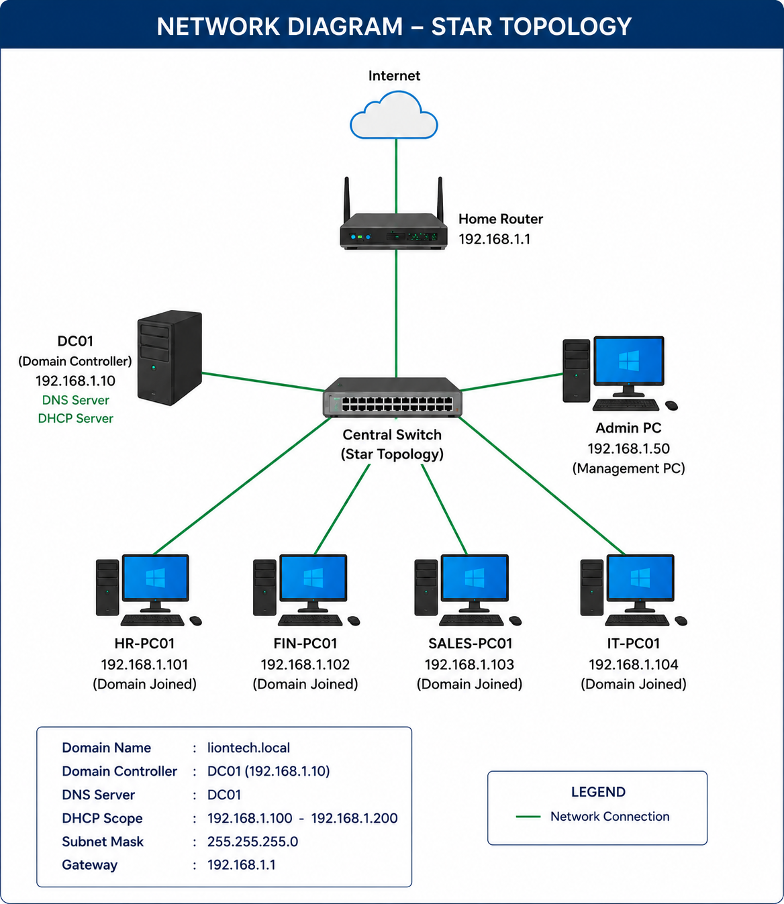

## How Can This Setup Be Better Secured?

Right now, this lab uses a "flat network," meaning all computers are in the same pool (`192.168.1.X`). While this is perfect for learning the basics of Active Directory, in a larger company, you want to stop different departments from seeing each other's computers.

Since I am currently an entry-level professional mastering core system administration, I can implement basic security controls right now without needing complex networking hardware:

### Utilizing Windows Defender Firewall
* **The Goal:** Prevent a standard user machine (like `SALES-PC01`) from scanning or connecting to a sensitive machine (like `FIN-PC01`).
* **The Fix:** I can use Group Policy Objects (GPOs) to centrally configure the built-in **Windows Defender Firewall with Advanced Security** across all client machines. By blocking inbound ICMP (ping) and local file-sharing ports between client workstations, machines are isolated from each other even if they sit on the same switch.

---

## Entry-Level Reflection & Learning Mindset

As an entry-level professional building this lab, I chose to focus on a straightforward star topology to truly master the foundational building blocks: Active Directory structures, GPOs, DHCP distribution, and DNS resolution. 

I understand that network security is a deep field. By starting with local firewall rules and basic isolation tricks, I am building the discipline required to keep systems secure. As I continue to explore and learn every single day, my next step will be studying network isolation protocols and advanced routing to further protect corporate environments.

  

