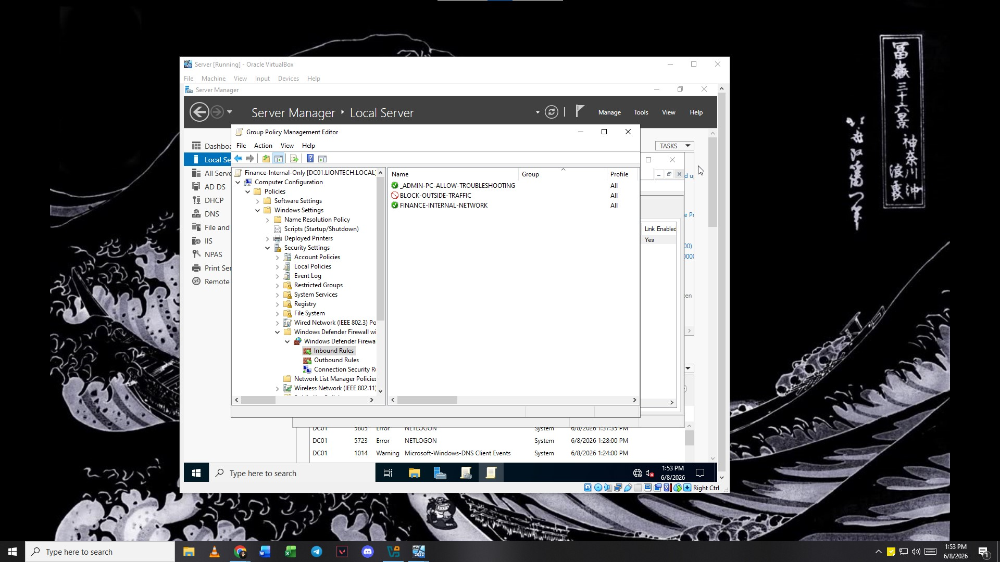
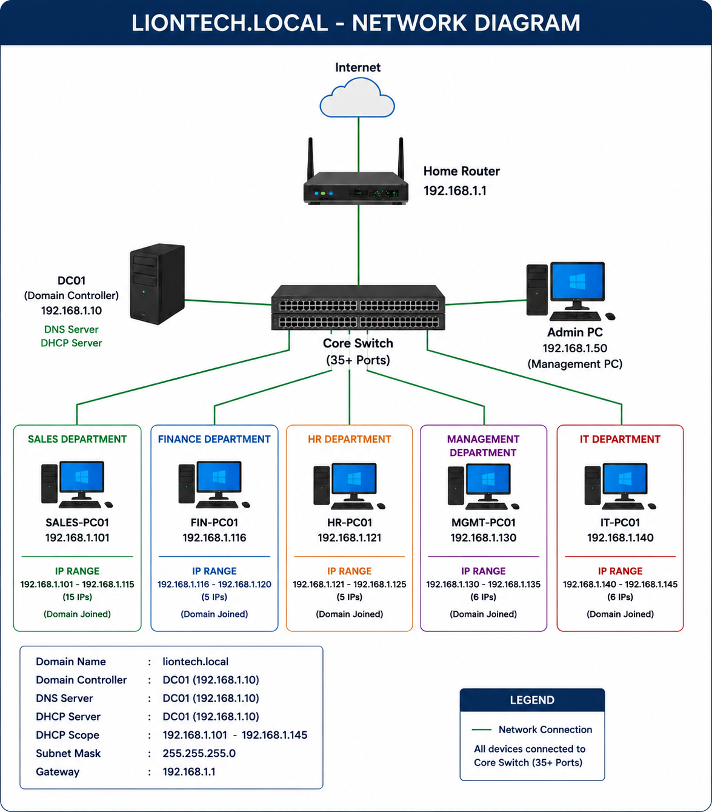

## How Can This Setup Be Better Secured?

Right now, this lab uses a "flat network," meaning all computers are in the same pool (`192.168.1.X`). While this is perfect for learning the basics of Active Directory, in a larger company, you want to stop different departments from seeing each other's computers.

Since I am currently an entry-level professional mastering core system administration, I can implement basic security controls right now without needing complex networking hardware:

### Utilizing Windows Defender Firewall
#### The Goal: Prevent standard department workstations (like SALES-PC01 at 192.168.1.101) from scanning, pinging, or connecting to sensitive machines in other departments (like FIN-PC01 at 192.168.1.116), while still allowing communication within their own teams.

The Fix: Create and link target Group Policy Objects (GPOs) directly to the department sub-OUs (SALES-PCs and FIN-PCs) under the parent Workstations OU. These GPOs centrally configure Windows Defender Firewall with Advanced Security across all client machines using three distinct rule sets:

An Administrative Whitelist: Explicitly allows all inbound connections from the IT Admin PC (192.168.1.50) so IT staff can troubleshoot any machine seamlessly.

Intra-Department Allowance: Uses specific IP ranges (192.168.1.101 - 192.168.1.115 for Sales) to allow teammates to communicate and ping each other locally.

Cross-Department Block: Sets a blanket block on all incoming traffic originating from outside network blocks (e.g., blocking the Finance IP range on Sales machines and vice versa).

  

#### Results:

  

## Entry-Level Reflection & Learning Mindset

As an entry-level professional building this lab, I chose to focus on a straightforward star topology to truly master the foundational building blocks: Active Directory structures, GPOs, DHCP distribution, and DNS resolution. 

I understand that network security is a deep field. By starting with local firewall rules and basic isolation tricks, I am building the discipline required to keep systems secure. As I continue to explore and learn every single day, my next step will be studying network isolation protocols and advanced routing to further protect corporate environments.
## **STAR TOPOLOGY**

  

