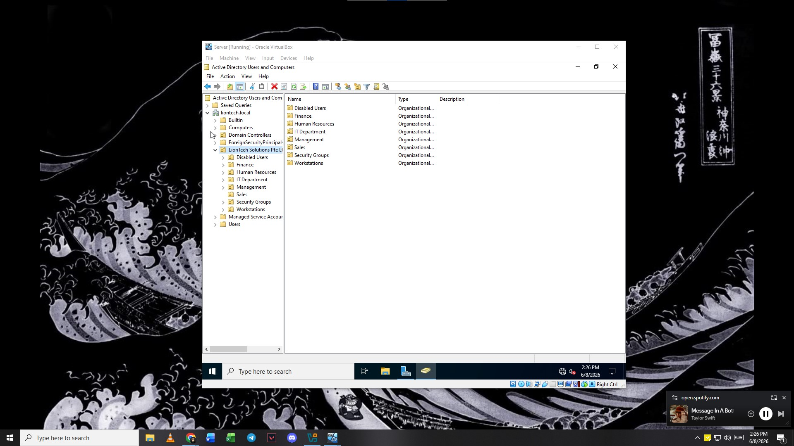
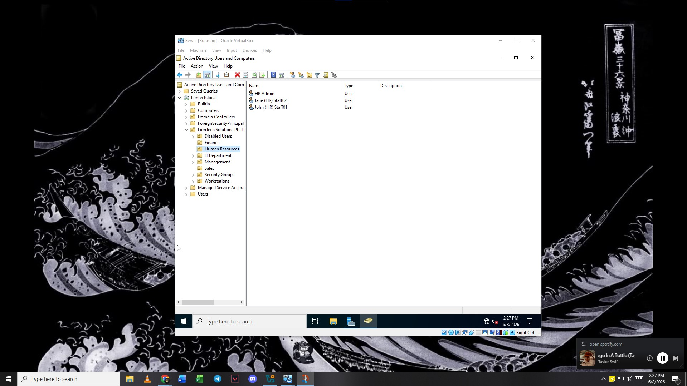
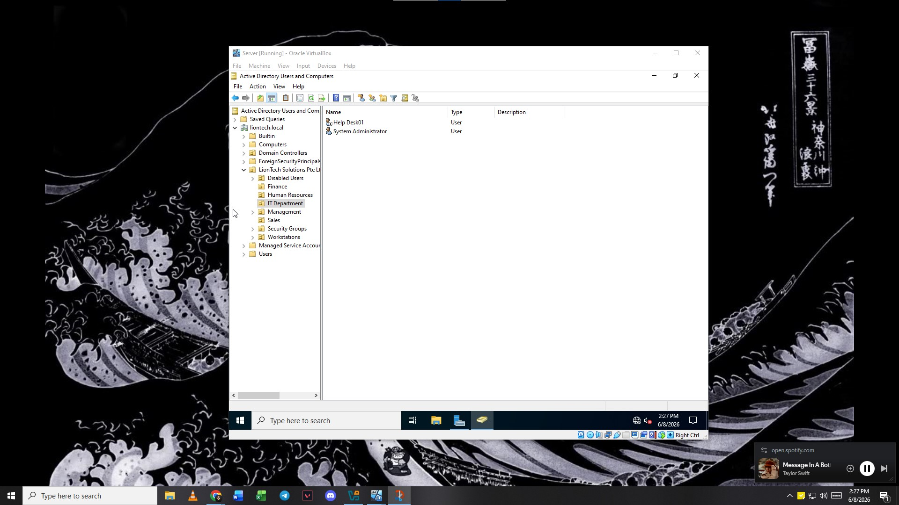
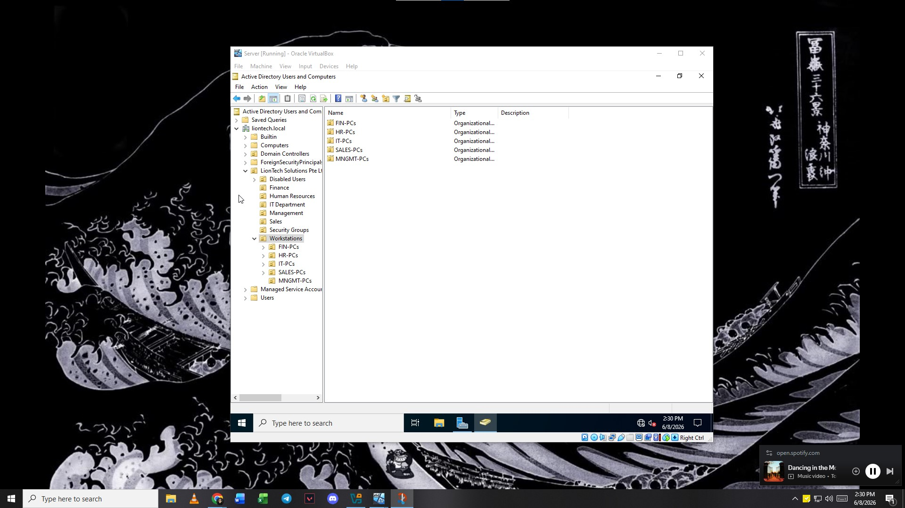

# Active Directory Organizational Unit (OU) Structure

An organized Active Directory hierarchy is the foundational baseline of a secure and manageable corporate network. This document breaks down the design logic of the `liontech.local` Organizational Unit (OU) layout, which is engineered to support role-based management, granular Group Policy application, and clean administration.

---
## Virtual Machine Implementation Walkthrough

Below are the live verification screenshots taken from the primary Domain Controller (`DC01`) within *Active Directory Users and Computers (ADUC)*, demonstrating the actual layout of the deployed environment.

### 1. Root Domain View (`liontech.local`)
This overview shows the complete high-level custom OU tree layout designed to support our 50-user organization.

  

---

### 2. Departmental User OUs
Each departmental OU contains the standardized service accounts, administrative staff, and standard user accounts assigned to that specific business unit.

#### Management OU
*Contains the executive leadership and operations management accounts.*

  

#### Human Resources OU
*Contains HR staff accounts handling sensitive employee records and PII.*

  

#### Finance OU
*Contains accounting team accounts managing financial books and shares.*

  

#### Sales OU
*Contains the front-facing pipeline and marketing execution teams.*

  

#### IT Department OU
*Contains the designated system administrators and helpdesk personnel.*

  

---

### 3. Security Groups OU
This container isolates our global role-based security groups (`GG_MANAGEMENT`, `GG_HR`, `GG_FINANCE`, `GG_SALES`, `GG_IT`). These groups are mapped directly to file screening rules and folder access permissions.

  

---

### 4. Workstations Sub-OUs
To allow targeted computer configurations, workstations are divided into subcontainers matching the department of the physical machine.

  

---

### 5. Disabled Users OU
When an employee undergoes offboarding, their account is stripped of memberships, disabled, and moved here to guarantee they have zero residual access to local or network resources.

  

