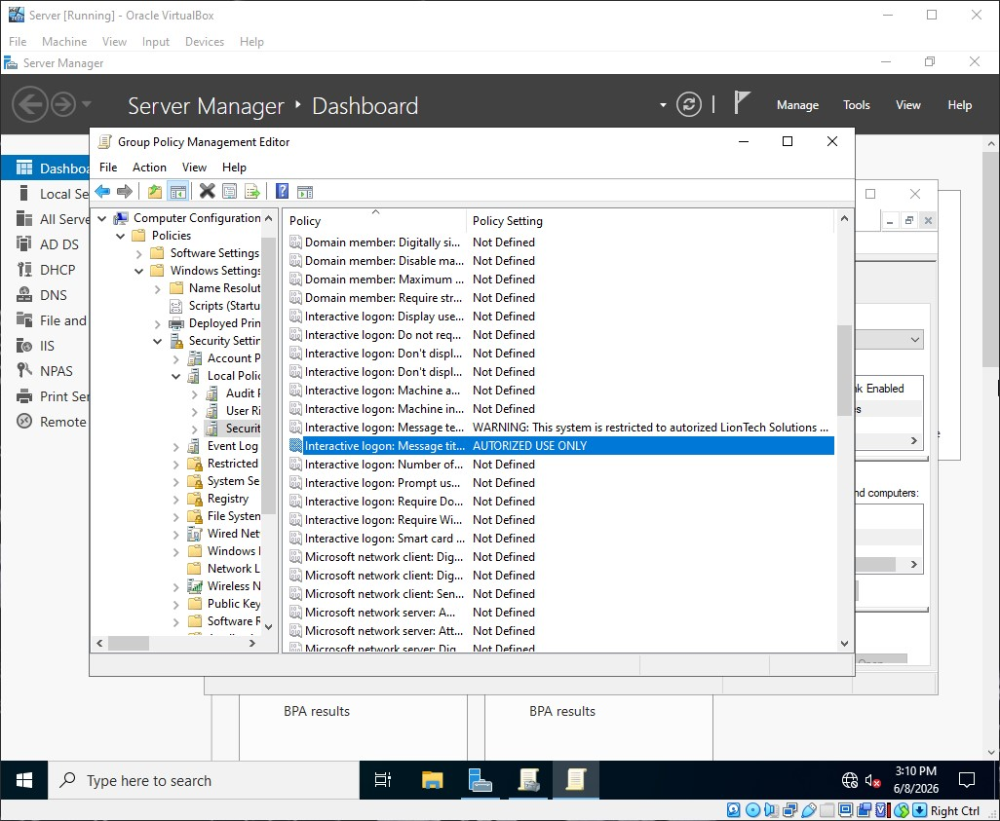
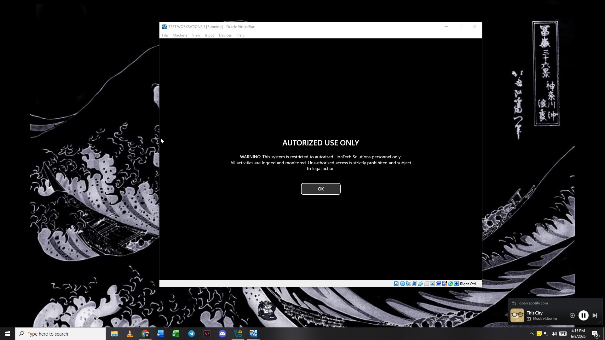

# Interactive Logon Warning Policy

This document details the configuration and security baseline of the Interactive Logon Warning Policy for liontech.local.

---

### Target Scope
* Scope: Domain-Wide (All Organizational Units)
* Target Objects: All interactive login sessions on any domain-joined endpoint or server.

### Why is this Important?
 Displaying a legal warning banner before login serves two critical purposes: **Corporate Liability** and **Attacker Deterrence**. In many jurisdictions, a company cannot legally prosecute an unauthorized intruder or insider threat if the system did not explicitly state that access is restricted and monitored. This policy creates a mandatory legal barrier before system access is granted.

---

### GPO Configuration Details

Path: Computer Configuration > Policies > Windows Settings > Security Settings > Local Policies > Security Options

#### Logon Warning Rules
| Policy Setting | Value | Legal & Security Purpose |
| :--- | :--- | :--- |
| **Interactive logon: Message text for users attempting to log on** | `WARNING: This system is restricted to authorized LionTech Solutions personnel only. All activities are logged and monitored. Unauthorized access is strictly prohibited and subject to legal action.` | Explicitly states that all actions are audited and unapproved users face legal consequences. |
| **Interactive logon: Message title for users attempting to log on** | `AUTHORIZED USE ONLY` | Captures the user's attention with a clear, authoritative heading before credentials can be typed. |

---

### Deployment Verification & Screenshots

#### 1. Group Policy Management Editor Configuration
This screenshot verifies the registry-level security policy options string inputs configured on the Primary Domain Controller (DC01).

#### 2. Client-Side Enforcement Verification
A screenshot of the Windows desktop login screen on a domain endpoint, showing that the legal text block appears and requires the user to click "OK" before showing the credential prompt.

