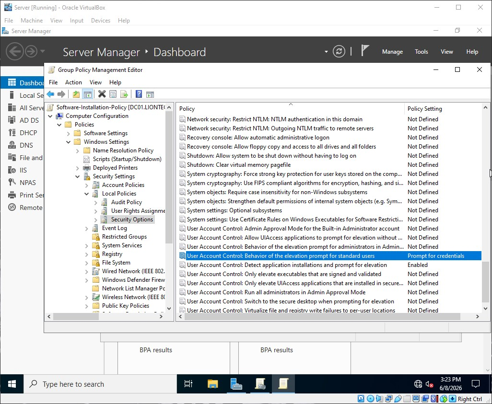

# Software Installation Block Policy

This document details the configuration and security baseline of the Software Installation Block Policy for liontech.local.

---

### Target Scope
* Scope: Workstations Organizational Unit (OU)
* Target Objects: All standard domain user accounts operating on network endpoints.

### Why is this Important?
Allowing standard users to install unapproved software is a primary cause of **Malware Ingress**, system instability, and shadow IT within an enterprise network. Non-technical staff may accidentally execute malicious installers, toolbars, or software that bypasses corporate security auditing. Restricting execution privileges ensures the software baseline remains standardized and secure.

---

### GPO Configuration Details

Path: Computer Configuration > Policies > Windows Settings > Security Settings > User Account Control

*Note: This policy enforces Least Privilege by ensuring that standard users cannot bypass the local administrative credential barrier.*

#### App Restrictions & UAC Rules
| Policy Setting | Value | Security Purpose |
| :--- | :--- | :--- |
| **User Account Control: Behavior of the elevation prompt for standard users** | `Prompt for credentials` | Completely blocks silent software installations by requiring local or domain administrator credentials to run any setup executable. |
| **User Account Control: Detect application installations and prompt for elevation** | `Enabled` | Automatically detects legacy installer packages and forces them to trigger a User Account Control (UAC) block page. |

---

### Deployment Verification & Screenshot

Group Policy Management Editor Configuration
This screenshot verifies the User Account Control behavior policies configured on the Primary Domain Controller (DC01).

