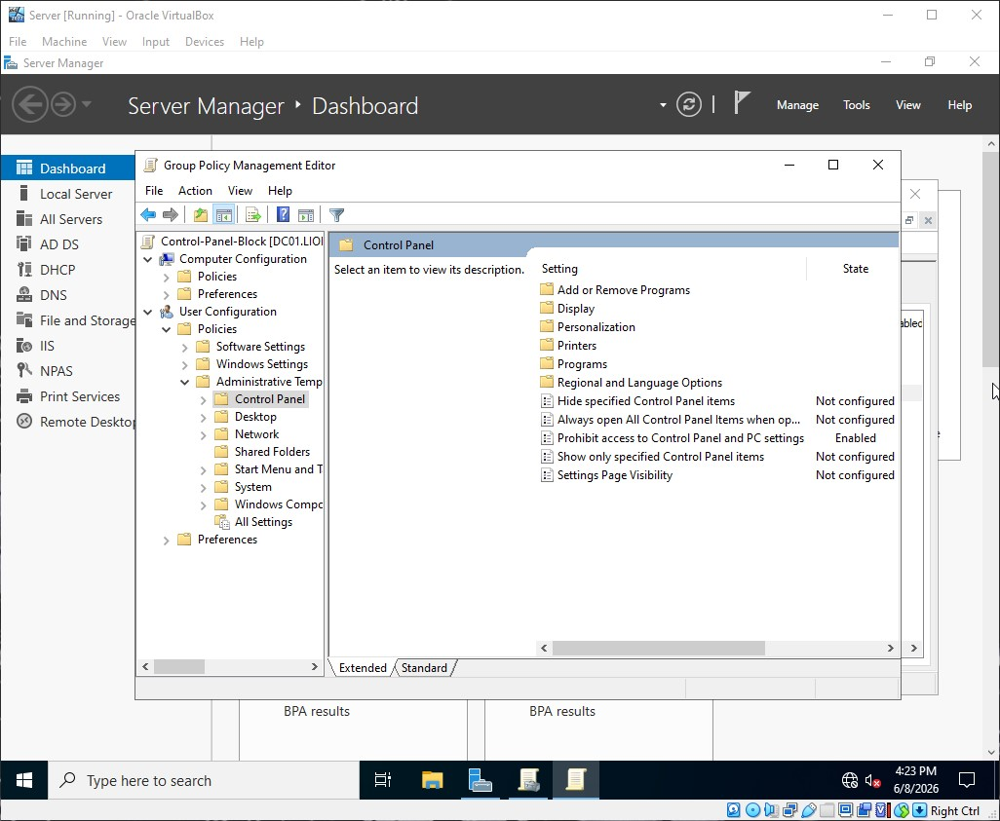
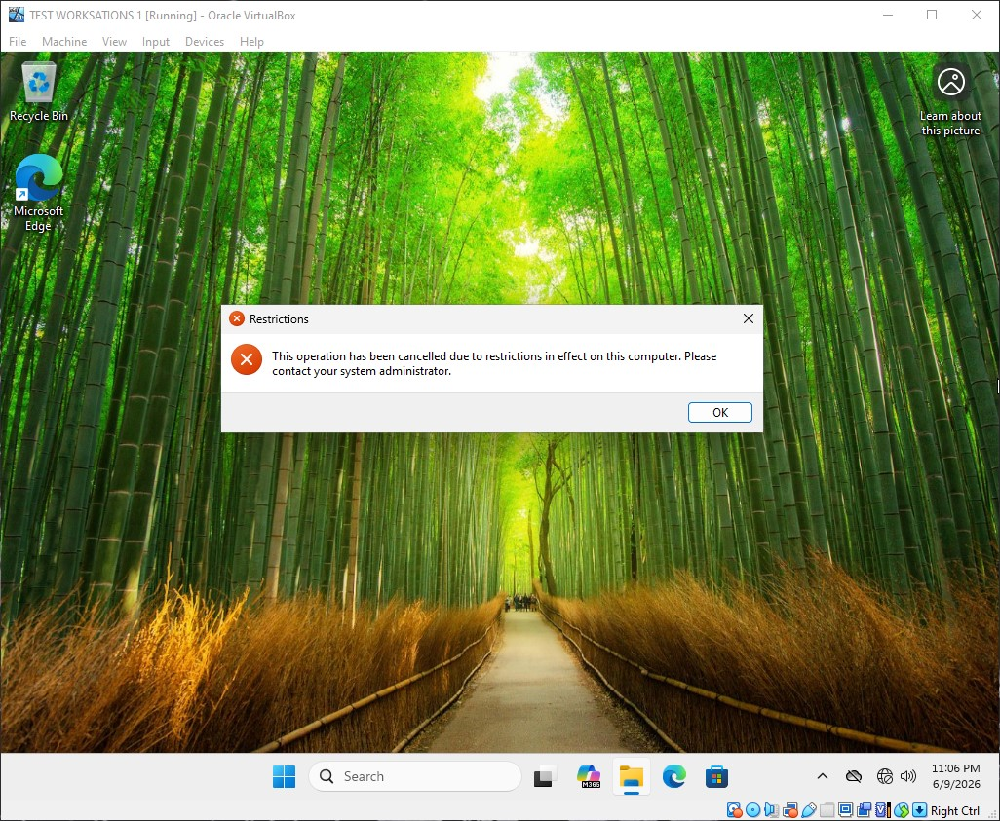

# Control Panel Restriction Policy

This document details the configuration and security baseline of the Control Panel Restriction Policy for liontech.local.

---

### Target Scope
* Scope: Sales Organizational Unit (OU)
* Target Objects: All standard user accounts within the Sales department.

### Why is this Important?
Standard business users do not require access to underlying operating system settings to perform their daily tasks. Allowing access to the Control Panel or Windows Settings menu introduces the risk of **Accidental Configuration Changes**, such as users inadvertently altering display adapters, disabling network interfaces, or changing local localization configurations. Restricting this access maintains environment stability and reduces avoidable IT helpdesk tickets.

---

### GPO Configuration Details

Path: User Configuration > Policies > Administrative Templates > Control Panel

#### Management Restriction Rules
| Policy Setting | Value | Security & Operational Purpose |
| :--- | :--- | :--- |
| **Prohibit access to Control Panel and PC settings** | `Enabled` | Disables `control.exe` and blocks the modern Windows Settings application entirely for targeted users. |

---

### Deployment Verification & Screenshots

#### 1. Group Policy Management Editor Configuration
This screenshot verifies the system restriction parameters configured on the Primary Domain Controller (DC01) targeting the Sales OU.

#### 2. Client-Side Enforcement Verification
Attempting to launch the Control Panel or open Settings on a Sales workstation (e.g., `SALES-PC01`) triggers an error message stating, "This operation has been cancelled due to restrictions in effect on this computer," and immediately blocks access.

