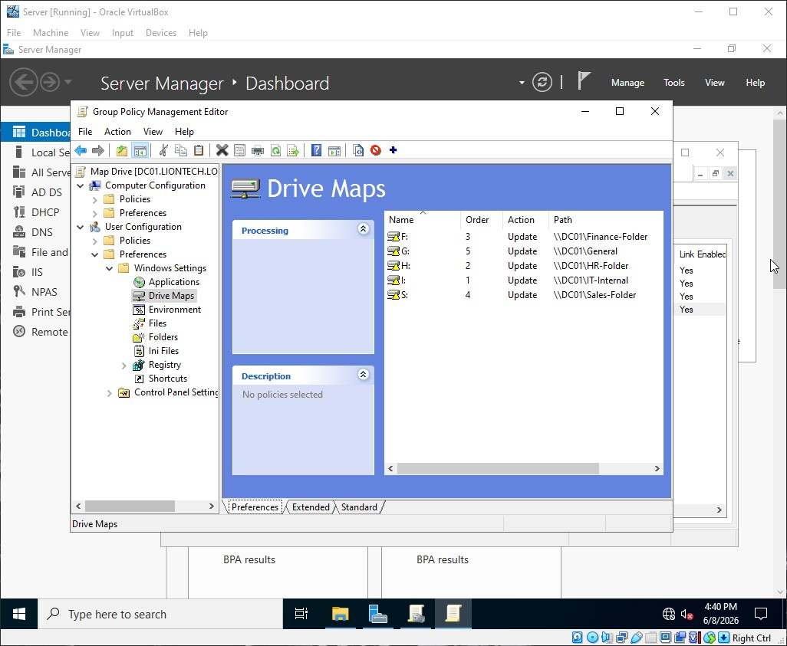
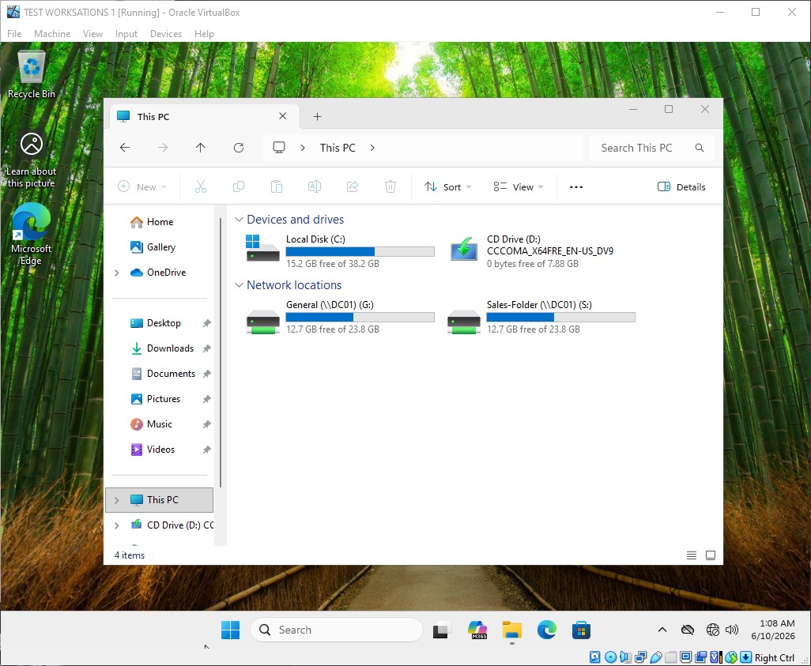

# Map Network Drives Policy

This document details the configuration and operational baseline of the centralized Drive Mapping Policy for liontech.local.

---
### Target Scope
* Scope: Human Resources, Finance, and Sales Organizational Units (OUs)
* Target Objects: All standard user accounts within HR, Finance, and Sales.

### Why is this Important?
In an enterprise, users should never have to manually map network paths or guess where their department files live. Centralizing drive mapping through Group Policy automates data access, standardizes drive letters across the company, and ensures users instantly see their departmental storage folders upon login.

---

### GPO Configuration Details

Path: User Configuration > Preferences > Windows Settings > Drive Maps

#### Drive Mapping Rules
| Department / Group | Drive Letter | Path | Action | Operational Purpose |
| :--- | :--- | :--- | :--- | :--- |
| All Employees | G: | \\liontech.local\Shares\General | Update | Mounts the general public folder for company-wide documents and templates. |
| IT Department | I: | \\liontech.local\Shares\IT-Internal | Update | Mounts the administration share containing deployment tools, scripts, and documentation. |
| Human Resources | H: | \\liontech.local\Shares\HR | Update | Automatically mounts the secure HR department file share. |
| Finance | F: | \\liontech.local\Shares\Finance | Update | Automatically mounts the secure accounting and finance share. |
| Sales | S: | \\liontech.local\Shares\Sales | Update | Automatically mounts the front-facing pipeline and marketing share. |

*Note: Item-Level Targeting is used to ensure users only receive the drive mapping for their specific department.*

---

### Deployment Verification & Screenshots

#### 1. Group Policy Management Editor Configuration
This screenshot verifies the preference properties, target file paths, and item-level targeting parameters configured on the Primary Domain Controller (DC01).

#### 2. Client-Side Enforcement Verification
Opening "This PC" on a domain workstation shows the correct network location automatically mapped under Network Locations with the designated drive letter.

