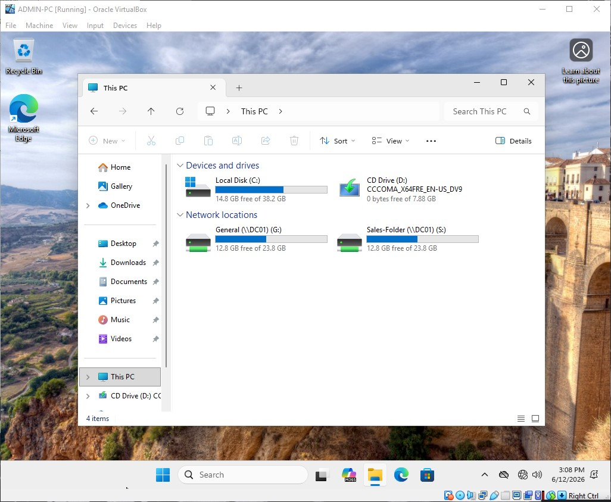

# Network Share Configuration: Sales Share

This document details the deployment parameters, access controls, and storage compliance rules for the corporate sales and pipeline file share.

---

### Infrastructure Provisioning
* **Share Name:** Sales Share
* **Network Path (UNC):** `\\DC01\SALES-Share$`
* **Storage Volume Location:** `E:\Shares\SALES-Share`
* **Visibility:** Hidden Share (`$`)

---

### Access Control Matrix (Overlapping Permissions)

| Identity Principal | Share Permission | NTFS Permission | Effective Right | Operational Role |
| :--- | :--- | :--- | :--- | :--- |
| **GG_SALES** | Change | Modify | **Read, Write, Modify** | Management of proposals, contracts, and decks. |
| **Domain Admins** | Full Control | Full Control | **Full Control** | Core volume health retention. |
| **Everyone / Others** | None | None | **No Access** | Segmented away from sales targets. |

---

### FSRM File Screening Restrictions
Mitigates typical phishing vector delivery risks by denying common storage configurations used to wrap or execute software payloads.

* **Screening Type:** Active Screening
* **Targeted Block Groups:** `Executables` & `Zip Files`
* **Enforced Extensions:** `.exe`, `.msi`, `.zip`, `.rar`
* **Justification:** Prevents sales agents from processing incoming compressed containers locally on the server volume, bypassing external gate scanners.

---

### Deployment Verification & Screenshots

 
