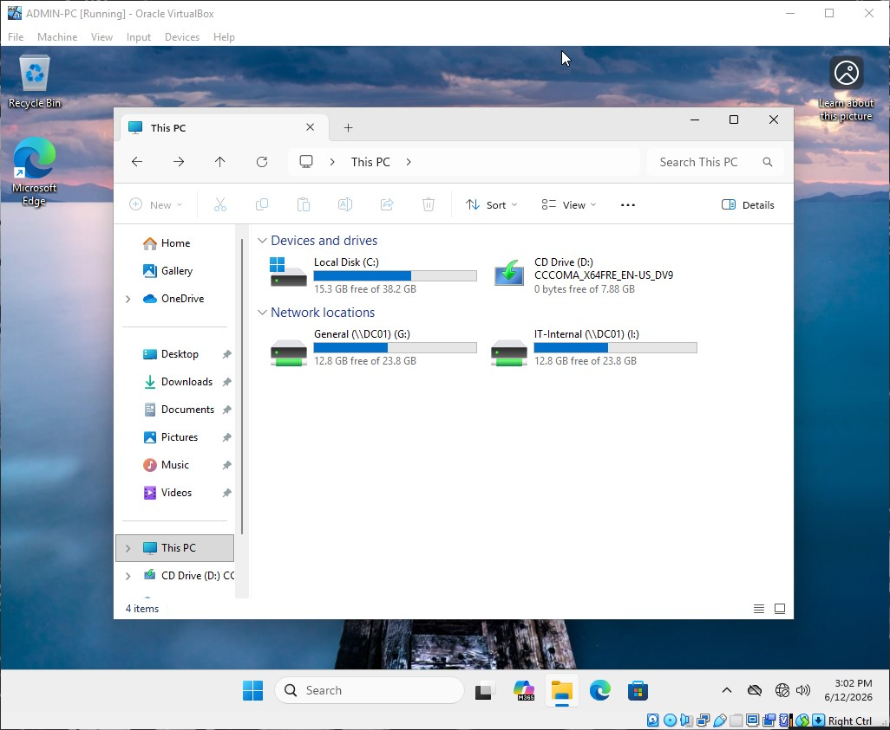

# Network Share Configuration: General Share

This document details the deployment, permissions matrix, and File Server Resource Manager (FSRM) screening baseline for the public collaborative file space.

---

### Infrastructure Parameters
* **Share Name:** `General$`
* **Network Path:** `\\DC01\General$`
* **Client Mapping Target:** `G:\ Drive` (Enforced via Group Policy)
* **Hosting Volume:** `E:\Shares\General`

---

### Access Control Matrix
| Security Principal | Share Permissions | NTFS Permissions | Combined Effective Rights |
| :--- | :--- | :--- | :--- |
| **Domain Users** | Change / Read | Modify / Read / Write | **Modify / Read / Write** (Allows all company employees to read and write shared assets) |
| **Domain Admins** | Full Control | Full Control | **Full Control** (Total visibility and file tree maintenance controls) |

---

### FSRM File Screening Restrictions
Because this directory is open to the entire enterprise, it presents the highest vector for internal malware transmission. Hardening constraints are highly restrictive.

#### Blocked File Groups
* **Executables & Scripting Files:** `.exe`, `.scr` (Strictly blocks execution software and old legacy screen savers).
* **Virtual Images & System Elements:** `.iso`, `.vhd` (Prevents users from staging whole operating systems or packing massive bulk virtual disk files).

#### Screening Type
* **Active Screening:** Automated block tracking matching security constraints.

---

### Deployment Verification & Screenshots

 
