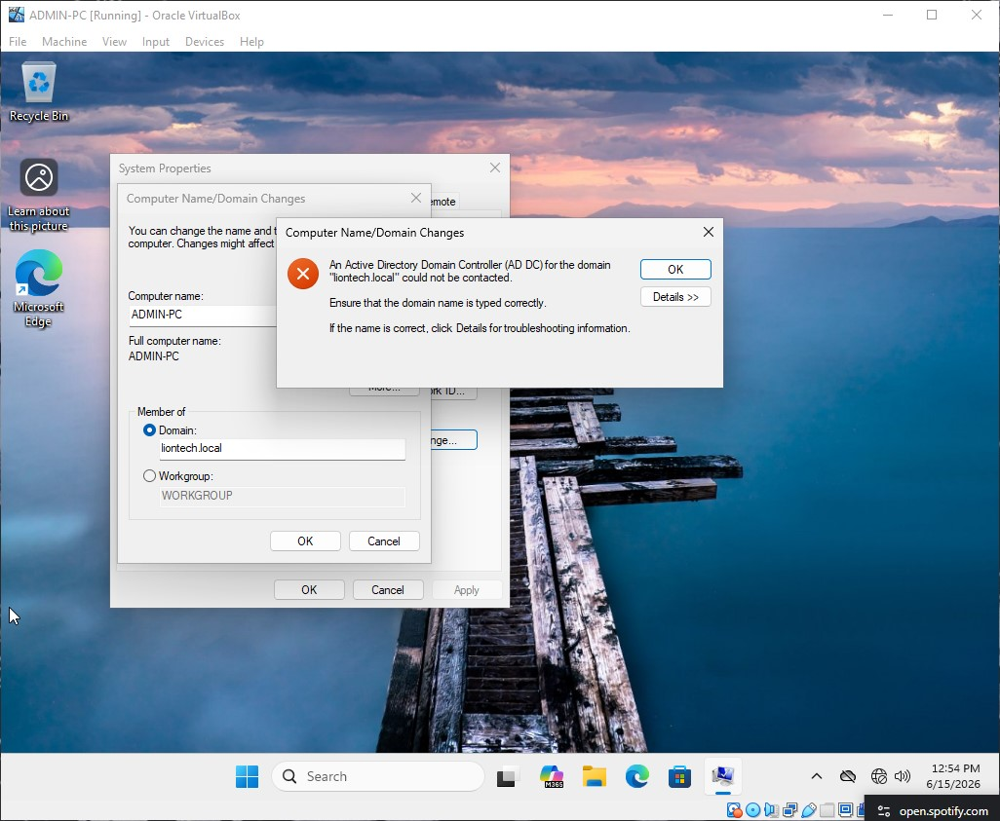
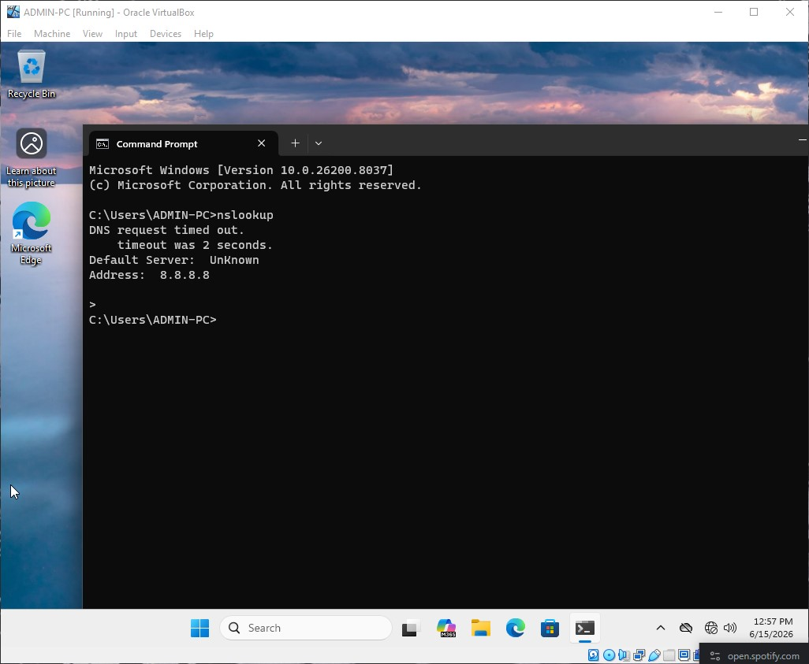
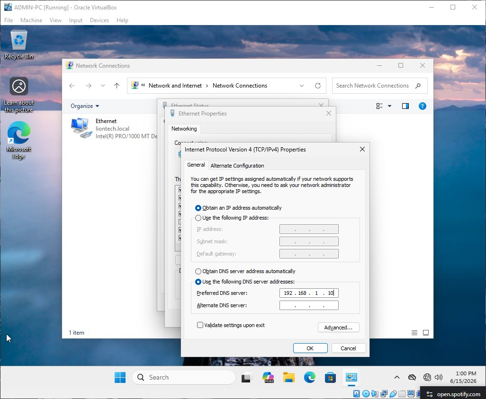
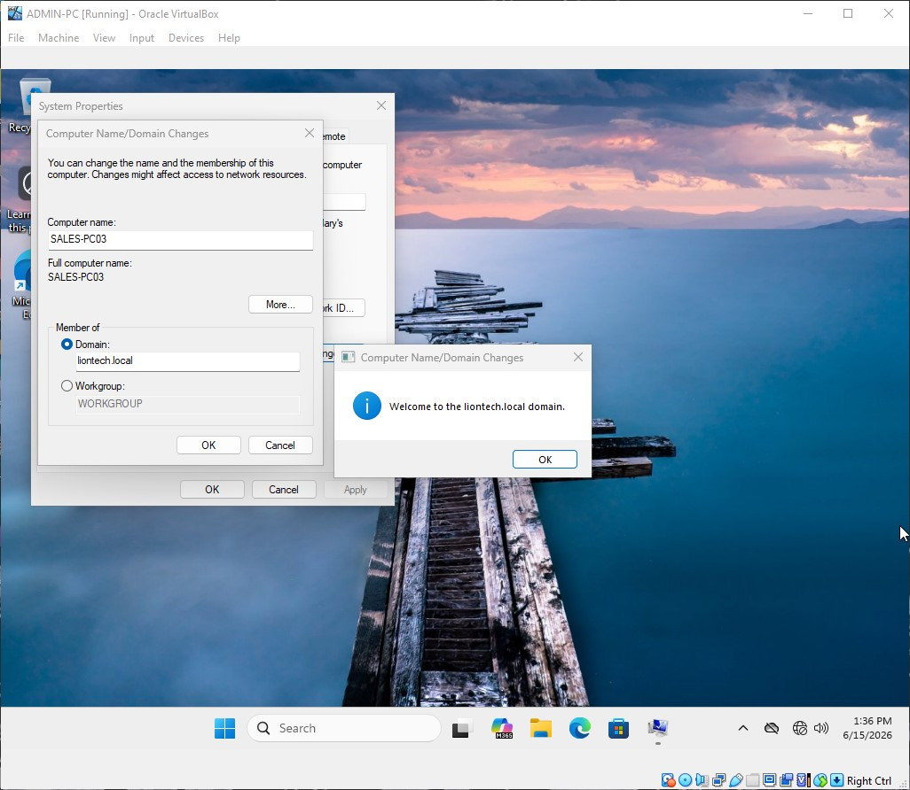

# Troubleshooting Case Study #1: Workstation Domain Join Failure

This entry covers the diagnostic workflow, infrastructure analysis, and remediation steps applied to resolve an active workstation deployment failure during employee onboarding.

---

### The Real-World Scenario
It is day one for Michael (`sales03`), a newly hired Business Development Representative in the Sales department. The IT Helpdesk has provisioned her active identity profile in Active Directory and unboxed a standard-issue corporate desktop computer asset (`SALES-PC03`). 

The support specialist plugs the workstation into the department's network switchport, boots up Windows, and opens the system properties to join the machine to `liontech.local`. However, upon entering the domain name, the machine hangs for 30 seconds before spitting out a critical error message stating that the domain controller cannot be reached. Jane cannot log in, and her onboarding deployment is at a complete standstill.

---



### Ticketing System Log

**LionTech IT Support Portal — Service Ticket**

* **Ticket ID:** TS-2026-001
* **Priority:** Medium
* **Assigned Engineer:** `helpdesk01` (IT Support Specialist)
* **Requesting User:** `sales03` (Michael)
* **Department:** Sales Department
* **Affected Asset ID:** `SALES-PC03`

| Timestamp | Submitter | Log / Action Notes |
| :--- | :--- | :--- |
| `2026-06-05 08:30` | `helpdesk01` | **Ticket Opened.** Attempting to join asset `SALES-PC03` to `liontech.local`. Process failed with error: *"An Active Directory Domain Controller for the domain could not be contacted."* |
| `2026-06-05 08:42` | `helpdesk01` | **Diagnostic Run.** Ran `nslookup`. Found that the workstation is pulling a public Google DNS address via an unconfigured network interface adapter rather than pointing to our DC. |
| `2026-06-05 08:55` | `helpdesk01` | **Remediation.** Configured static internal DNS settings, flushed the local cash registers, and successfully rejoined the domain tree. Ticket closed. |

---

### Technical Documentation

#### Problem
During system deployment, the workstation asset `SALES-PC03` failed to join the corporate network infrastructure (`liontech.local`). The client operating system rejected the join configuration, reporting that it could not discover or establish a handshake with the primary Domain Controller (`DC01`).

#### Cause
The root issue was identified as a **DNS Misconfiguration**. The network adapter interface on the workstation was configured to pull its primary DNS automatically, defaulting to a public external DNS resolver (`8.8.8.8`). Because public web lookup servers have zero knowledge of private Active Directory namespaces and underlying SRV locator records, the system could not identify the local authority path.



#### Solutions
1. Opened the Network Connections control pane (`ncpa.cpl`) on the target client machine.
2. Modified the IPv4 properties of the active network interface adapter.
3. Swapped out the automatic public server entry and set it to point **solely** to the static internal IP address of the Domain Controller (`192.168.1.10`).



4. Opened an administrative Command Prompt and purged the local network cache registers:
```cmd
   ipconfig /flushdns
```
### How to Capture Deployment Verification Screenshots
To properly display evidence of your fix in your GitHub project, capture and name the following snapshots:

#### Domain Membership Success Confirmation
What to capture: Open System Properties (sysdm.cpl) on the client machine after performing the fix.

Focus: Capture the final confirmation dialog pop-up window that explicitly reads: "Welcome to the liontech.local domain."


