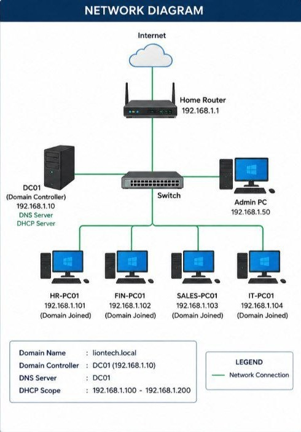
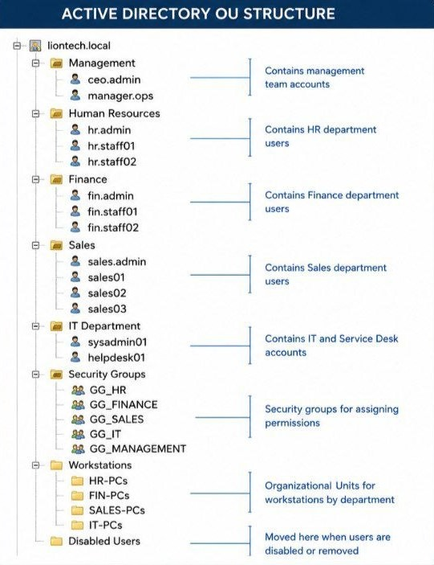
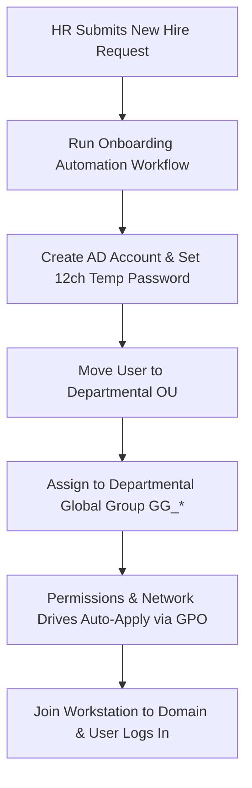
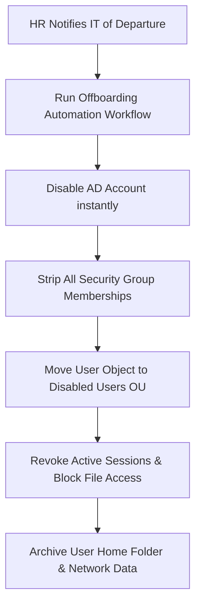

# Active Directory Enterprise Lab: LionTech Solutions Pte Ltd

## Project Overview
LionTech Solutions Pte Ltd is a simulated Singapore-based IT services company with 50 employees. This project demonstrates how Active Directory can be used to manage users, computers, permissions, security policies, and administrative tasks in a business environment. 

## Project Objectives
The main goal of this project is to build a functional, organized, and secure IT environment for a small business from the ground up. 

By building this lab, I am demonstrating how to manually handle core system administration tasks:

*   **User & Computer Organization:** Designing a clean Organizational Unit (OU) structure to easily manage the company’s 50 employees and their computers by department.
*   **Security Policies (GPOs):** Creating and applying Group Policy Objects to enforce basic company rules, such as password requirements, automatic screen locks, and restricting access to sensitive system settings.
*   **File & Folder Sharing:** Setting up shared network folders (like an HR or Finance share) and using security groups to ensure employees can only access files meant for their department.
*   **Centralized Management:** Managing all network resources, user accounts, and computer settings from a single, centralized Domain Controller.

## Technologies Used

This project relies on industry-standard virtualization and Microsoft server technologies to simulate a real-world office network:

*   **Windows Server (2022):** Actively running as the primary **Domain Controller (DC)**, hosting the Active Directory Domain Services (AD DS) role.
*   **Windows 11 Pro:** Deployed on client virtual machines to simulate employee workstations connected to the domain.
*   **Active Directory Users and Computers (ADUC):** Used to manually provision, organize, and manage user accounts, computer objects, and security groups.
*   **Group Policy Management Console (GPMC):** Used to create, configure, and deploy system-wide security and desktop policies (GPOs).
*   **Oracle VirtualBox:** The virtualization platform hosting the server and client machine environment.

## Network Topology Overview

The infrastructure utilizes a centralized, flat network design tailored for a small business environment. All internal systems connect through a primary network switch, which links back to a gateway router (`192.168.1.1`) to provide secure external internet access.
To simulate a real corporate setting, the network includes a dedicated management workstation for administrators alongside separate domain-joined client PCs representing core business departments: Human Resources, Finance, Sales, and Information Technology.

  

## Active Directory OU Structure

As shown in diagram, the domain follows a department-based Organizational Unit (OU) hierarchy designed for efficient management, clear group policy targeting, and simple user administration. 

The structure is broken down into four core categories:

*   **Department OUs:** Separate folders for **Management, Human Resources, Finance, Sales, and IT** to keep user accounts organized by their actual business function.
*   **Security Groups OU:** A dedicated, centralized location for all Global Groups (`GG_HR`, `GG_FINANCE`, etc.), making it easy to manage role-based access control and folder permissions.
*   **Workstations OU:** Subdivided by department to ensure that computer-specific Group Policies (GPOs) are only applied to the correct machines.
*   **Disabled Users OU:** A staging environment used as a security best practice for offboarding, isolating accounts that are deactivated or scheduled for removal.

  

## Group Policy Objects (GPOs)

The following policies are implemented to secure the network, protect company data, and standardize the user environment. Click on any GPO name to view its full configuration details and deployment screenshots.

| GPO Name (Full Walkthrough) | Targeted Scope | Description & Business Reason |
| :--- | :--- | :--- |
| [Password Policy](./gpo/01-password-policy.md) | Domain-Wide | Enforces 12+ characters, complexity rules, and an automatic account lockout after 5 failed attempts. |
| [Screen Lock Timeout](./gpo/02-screen-lock.md) | All Users | Automatically locks the workstation screen after 15 minutes of inactivity to protect unattended desks. |
| [Interactive Logon Warning](./gpo/03-logon-warning.md) | Domain-Wide | Displays a legal warning banner before login stating that system activity is restricted and monitored. |
| [Software Installation Block](./gpo/04-software-block.md) | Workstations OU | Prevents standard users from running unapproved installers to keep the network secure and malware-free. |
| [Disable CMD & PowerShell](./gpo/05-disable-cli.md) | Standard Users | Blocks command-line access for non-IT staff to stop unauthorized system exploration or script execution. |
| [Remove "Run as Admin"](./gpo/06-remove-run-as-admin.md) | Workstations OU | Suppresses local administrative escalation prompts for standard users to enforce strict least-privilege access. |
| [USB Storage Block](./gpo/07-usb-block.md) | Finance & HR OUs | Disables external USB mass storage devices to prevent data leakage of sensitive files or PII. |
| [Control Panel Restriction](./gpo/08-control-panel-restrict.md) | Sales OU | Restricts access to system settings to prevent accidental configuration changes by non-technical staff. |
| [Company Wallpaper](./gpo/09-company-wallpaper.md) | All Users | Sets a corporate background featuring an "Authorized Use Only" warning for branding and compliance. |
| [Map Network Drives](./gpo/10-map-network-drives.md) | HR, Finance, & Sales | Automatically mounts specific departmental network shares (H:\, F:\, S:\) based on user roles. |

---

## Security Groups Configuration

To enforce Role-Based Access Control (RBAC), the following Global Security Groups are created within the `Security Groups` OU. These groups are used to manage file share permissions and dictate user capabilities across the domain:

| Group Name | Targeted Department | Type / Scope | Description & Access Level |
| :--- | :--- | :--- | :--- |
| **GG_MANAGEMENT** | Management | Security / Global | Grants the executive team access to corporate management folders and high-level business data. |
| **GG_HR** | Human Resources | Security / Global | Grants access to the HR network share (`H:\`) containing confidential employee files and PII. |
| **GG_FINANCE** | Finance | Security / Global | Grants access to the Finance network share (`F:\`) for managing accounting and company financial records. |
| **GG_SALES** | Sales | Security / Global | Grants access to the Sales network share (`S:\`) for client accounts, pipelines, and marketing materials. |
| **GG_IT** | IT Department | Security / Global | Grants members standard IT team network share access. *(Note: Separate dedicated accounts are used for actual Domain Admin privileges).* |

---

## Shared Folder Permissions & File Restrictions

To ensure strict data isolation and role-based confidentiality, network file shares are configured with overlapping **Share/NTFS permissions** and **File Screening Restrictions** to prevent unauthorized or unnecessary file types from being stored:

| Share Name | Target Security Group | Share / NTFS Permissions | File Screening Restrictions (FSRM) | Description / Access Control |
| :--- | :--- | :--- | :--- | :--- |
| **HR Share** `\\DC01\HR-Share$` | GG_HR Domain Admins | Change Modify | **Block Executables & Audio/Video** (`.exe`, `.msi`, `.mp3`, `.mp4`) | **H:\ Drive** — Confidential HR documents and PII. Blocks installation files and personal media. |
| **Finance Share** `\\DC01\FIN-Share$` | GG_FINANCE Domain Admins | Change Modify | **Block Executables & Image Files** (`.exe`, `.msi`, `.jpg`, `.png`) | **F:\ Drive** — Accounting records. Blocks executable files and unnecessary image/photo files. |
| **Sales Share** `\\DC01\SALES-Share$` | GG_SALES Domain Admins | Change Modify | **Block Executables & Zip Files** (`.exe`, `.msi`, `.zip`, `.rar`) | **S:\ Drive** — Sales and marketing pipelines. Blocks application setups and compressed archives to mitigate malware risks. |
| **Common Share** `\\DC01\Common$` | Domain Users Domain Admins | Change Modify | **Block Executables & ISOs** (`.exe`, `.scr`, `.iso`, `.vhd`) | **Public Space** — General collaboration folder. Strictly blocks system images and script files to prevent local malware spreading. |

---

## User Lifecycle Management (Procedures & Automation)

To ensure operational efficiency and tight security, user onboarding and offboarding are standardized using automated workflows.

### 1. New Employee Onboarding Process

When a new staff member joins LionTech Solutions, their provisioning follows this strict sequence:

### 2. Employee Offboarding Process
When an employee leaves the organization, immediate de-provisioning is critical to prevent stale accounts and rogue access.

## 🛠️ Troubleshooting & Issue Resolution Index

The following table serves as an operational index of real-world issues encountered and resolved during the lab deployment. Click the links in the **Problem** column to view the full technical root-cause analysis, step-by-step resolutions, and configuration scripts.

| Problem (Full Walkthrough) | Cause | Short Resolution |
| :--- | :--- | :--- |
| [1. Workstation Domain Join Failure](./troubleshooting/01-domain-join.md) | **DNS Misconfiguration** — Workstation pointed to public DNS instead of the Domain Controller. | Configured client network adapter to point solely to the DC's static IP. |
| [2. GPO Changes Not Applying](./troubleshooting/02-gpo-failure.md) | **Targeting Mismatch** — GPO linked to Computer OU but contained User Configuration settings. | Relinked GPO to the correct User OU and ran `gpupdate /force`. |
| [3. Missing Department Share Drives](./troubleshooting/03-missing-drives.md) | **GPO Security Filtering** — Workstations lacked read permissions to process the drive-mapping GPO. | Added "Domain Computers" with Read permissions to the GPO delegation tab. |
| [4. AD Latency / Sync Delay](./troubleshooting/04-ad-latency.md) | **Replication Interval** — Changes made on DC01 hadn't automatically replicated to DC02 yet. | Triggered manual replication inside *Active Directory Sites and Services*. |
| [5. Folder Access Denied After Promotion](./troubleshooting/05-access-denied.md) | **Stale Kerberos Token** — User's active Windows session didn't include the new group SID. | Had the user sign out and sign back in to issue a fresh Kerberos ticket. |
| [6. User Desktops Showing Black Screens](./troubleshooting/06-wallpaper-bug.md) | **File Share Permissions** — GPO wallpaper path pointed to an inaccessible local admin folder. | Moved wallpaper file to the `SYSVOL` share so all domain users could read it. |
| [7. Continuous Account Lockouts](./troubleshooting/07-account-lockouts.md) | **Cached Credentials** — Stale password saved on a mapped drive or secondary device. | Located source machine via `LockoutStatus.exe` and cleared Credential Manager. |
| [8. FSRM Blocking Legitimate Files](./troubleshooting/08-fsrm-overblock.md) | **Aggressive Pattern Matching** — Block rule caught files with double extensions (e.g., `.exe.pdf`). | Adjusted File Server Resource Manager rule to strictly match trailing `*.exe`. |
| [9. IT Staff Blocked from CMD/PowerShell](./troubleshooting/09-it-lockout.md) | **GPO Scope Error** — Lockdown policy applied globally without an IT exclusion rule. | Modified GPO security filtering to Deny "Apply Group Policy" for the `GG_IT` group. |
| [10. Workstation Trust Relationship Dropped](./troubleshooting/10-time-skew.md) | **Kerberos Time Skew** — Workstation system time drifted more than 5 minutes from the DC clock. | Re-synced DC clock to an external NTP source and forced client resync via `w32tm`. |

---

---

## Lessons Learned & Key Engineering Takeaways

Building, securing, and troubleshooting the LionTech Solutions enterprise lab provided invaluable hand-on experience that bridges theoretical system administration with real-world infrastructure operations. Below are the core architectural takeaways from initial setup through to advanced troubleshooting:

### 1. Identity & Directory Architecture
* **Planning Over Provisioning:** Designing a scalable Active Directory hierarchy (OUs and Security Groups) *before* touching the server prevents administrative messy drift. Proper naming conventions (like using `GG_` prefixes) make applying permissions predictable and scalable.
* **The Principle of Least Privilege (PoLP):** Security is not a barrier to productivity; it is an operational standard. Restricting CMD, PowerShell, and local admin access ensures standard users can execute their jobs flawlessly while minimizing the overall attack surface of the organization.

### 2. Infrastructure Dependencies
* **DNS is the Backbone:** In an Active Directory environment, virtually all authentication, communication, and domain-joining issues root back to DNS. If DNS is misconfigured, the entire identity infrastructure breaks. 
* **Time Synchronization is Crucial:** Kerberos authentication relies heavily on tight time boundaries. Ensuring the Primary Domain Controller synchronizes with a reliable external NTP source is a non-negotiable step to prevent random network-wide authentication drops.

### 3. Policy Enforcement & Operations
* **Targeting Precision:** Group Policy Objects (GPOs) are incredibly powerful but require precision. A misapplied GPO can easily lock out an entire IT department or cause operational downtime (such as the desktop black-screen bug). Testing GPO scoping and utilizing delegation exclusions are critical sysadmin skills.
* **Storage and Data Hygiene:** Implementing data restrictions using FSRM prevents corporate storage from being abused by non-work files and serves as an important second layer of defense against accidental malicious script execution on network shares.

### 4. The Mindset of a Systems Administrator
* **Automation is Mandatory:** Hand-crafting every user and permission is inefficient and prone to human error. Transitioning to repeatable logic (such as standardized onboarding and offboarding workflows) ensures consistency and security compliance.
* **Documentation is the Real Work:** Building a lab is only half the battle. Documenting the complex failures, logging error codes, and indexing solutions creates an institutional knowledge base that saves hours of downtime during a critical production incident.
